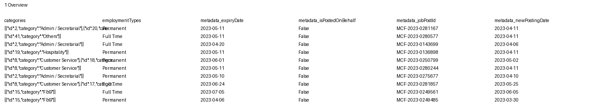
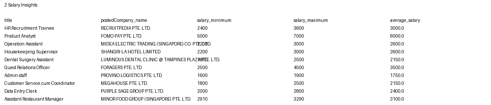
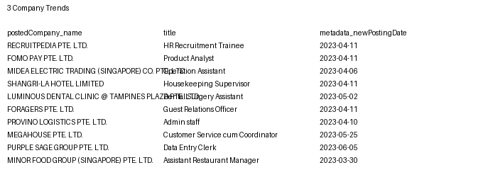
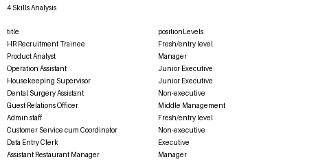

# Streamlit Dashboard — SG Job Market

This Streamlit app summarizes and visualizes `SGJobData (2).csv` (large file ~273MB) by streaming the CSV in chunks and creating sampled datasets for interactive charts.

## Quick start
1. Create a Python environment (recommended: conda) and install requirements:

   conda create -n jobdash python=3.10 -y
   conda activate jobdash
   pip install -r requirements.txt

2. Run the app from the `capstone/` folder:

   streamlit run streamlit_app.py

3. Open the displayed URL (usually `http://localhost:8501`) and use the sidebar to configure sample size, time aggregation, and percentile clipping.

## Notes
- The loader is designed to stream the data to avoid excessive memory use. It produces a sample for interactive visualizations.
- If you want faster iteration during development, create a small subsampled CSV and point the app at it via the sidebar.

## Screenshots 📸
Here are example snapshots generated from a representative sample of the dataset. These are saved under the `screenshots/` folder; you can regenerate them using `scripts/generate_screenshots.py`.

- **Executive dashboard:** 
- **Overview:** 
- **Salary Insights:** 
- **Company Trends:** 
- **Skills Analysis:** 

## Repository cleanup (important) ⚠️
To keep the repository small and avoid exceeding GitHub file-size limits, the large dataset `data/SGJobData (2).csv` was removed from the repository history.

A backup of the prior remote `main` branch was created as `backup-remote-main` before this change; if you need the previous history, you can inspect or restore from that branch.

If you want me to remove other large files or add metadata about dataset provenance (e.g., external storage links), I can add that as well.
